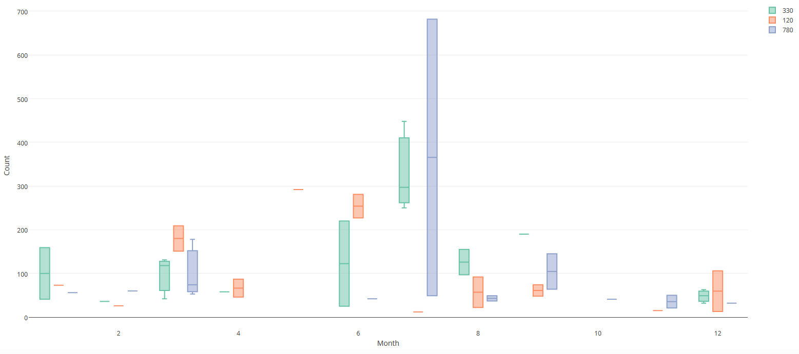

```{r, include = FALSE}
knitr::opts_chunk$set(
  collapse = TRUE,
  comment = "#>",
  warning = FALSE,
  message = FALSE
)
```
<!-- Insert image  -->


<!-- Describe datatype in one or two sentences. -->
Occurrence bats data from a passive acoustic monitoring network in the Belgian coast.

- Partners: [Flanders Marine Institute (VLIZ)](https://www.vliz.be/en/imis?module=institute&insid=36) and [Research Institute for Nature and Forest (INBO)](https://www.vliz.be/en/imis?module=institute&insid=5443)
- Period: since August 2015
- Geographical coverage: [Belgian coast](https://marineregions.org/gazetteer.php?p=details&id=2550)
- Taxonomic coverage: [Chiroptera](https://www.marinespecies.org/aphia.php?p=taxdetails&id=1037271)
- Moratorium: None
- Data quality: Proof-of-concept

## How to interpret this dataset

### Query options
* **Timeframe**: Starting and stopping date for the query.
* **Sample period**: Counts aggregated. One of 1 min, 60 min or 1 day.

### Available columns
* **Minute**: Minute at which the echolocation was detected.
* **Hour**: Hour at which the echolocation was detected.
* **Year**: Year at which the echolocation was detected.
* **Month**: Month at which the echolocation was detected.
* **Day**: Day at which the echolocation was detected.
* **Station**: Name or code of sampling station or receiver code.
* **Latitude**: Center latitude in decimal degrees, WGS84.
* **Longitude**: Center longitude in decimal degrees, WGS84.
* **Name**: Scientific species or genus name.
* **CallCount**: Total echolocation calls detections.
* **Length**: Duration of the echolocation call or calls in seconds.
* **SpeciesCount**: Total bat detections.
* **Time**: Time in UTC, beginning of sample timeperiod.

## Abstract
<!--- Normally the abstract is pulled from the IMIS record, but there was an issue when reading this connection. We had to let it go and just copy&paste manually. -->
Along the Belgian coast, a passive acoustic monitoring network was developed to record the echolocation calls of bats. At the moment, batcorders (Ecoobs) are installed at the lighthouse in Nieuwpoort, the Marine Station Ostend (MSO) and at zwin nature reserve.he bird hide in the nature reserve Zwin. The batcorders listen to the environmental sound every night and can detect bat calls above 16 kHz and above -36 dB. When a call is detected, the batcorder records the sound itself for a minimum of 400 ms (raw format). If another bat call is produced within these 400ms, it is recorded in the same file. Data transfer is done automatically and on a daily basis for the station located in Zwin. The other locations are manually retrieved and uploaded to the database twice a year.

To ensure qualitative recordings, the microphones are replaced every six months before the migration season (March and August). These full spectrum recordings are analyzed using software algorithms (batident) that classify the calls according to the bat species, genus or higher taxonomic group that produced the calls. Afterwards, all calls are validated. Some bat species produce very similar calls and are therefore grouped, e.g. parti-coloured bat, common noctule, Serotine bat and Leisler’s bat are group into the “Nyctaloid”. All myotis species (Brandt’s ,…) are grouped in family of Myotis. The more abundant pipistrelloid family produce more distinct calls and can therefore be identified up to species level (common pipistrelle, Nathusius’ pipistrelle and Soprano pipistrelle).


## How to cite these data

When using this tool, please acknowledge the LifeWatch Data Explorer in your work with the statment written below. Please also acknowledge the individual datasets used and mind their individual licenses: Find the complete list in this link to the [IMIS metadata record](https://www.vliz.be/en/imis?module=dataset&dasid=5251) of this data type.

> _This work makes use of the LifeWatch Data Explorer provided by VLIZ and funded by Research Foundation - Flanders (FWO) as part of the Belgian contribution to LifeWatch._

</br>
If you retrieved these data using the [LifeWatch Data Explorer R package](https://github.com/lifewatch/lwdataexplorer/), you should also cite it as: 

```{r citation, results = 'asis', echo = FALSE}
cat(paste0("> ", citation("lwdataexplorer")$textVersion))
```
