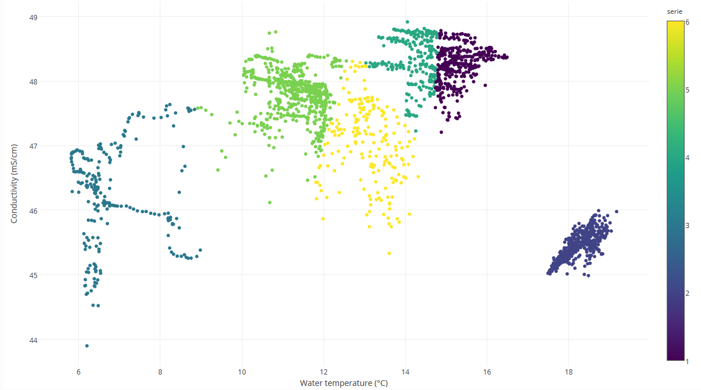

```{r, include = FALSE}
knitr::opts_chunk$set(
  collapse = TRUE,
  comment = "#>",
  warning = FALSE,
  message = FALSE
)
```
<!--- Insert image  -->


<!--- Describe datatype in one or two sentences. -->
Data from buoys installed in the Belgian Part of the North Sea.

- Partners: [Flanders Marine Institute (VLIZ)](https://www.vliz.be/en/imis?module=institute&insid=36), with support from C-power
- Period: since September 2015
- Geographical coverage: [Thornthon Shoal](https://marineregions.org/gazetteer.php?p=details&id=2438), [Belgian Exclusive Economic Zone](https://www.marineregions.org/gazetteer.php?p=details&id=3293)
- Taxonomic coverage: Abiotic data only
- Moratorium: None
- Data quality: Unknown
 
## How to interpret this dataset
 
### Query options
* **Timeframe**: Starting and stopping date for the query.
* **Stations**:  List of stations to be included in the query.
 
### Available columns
* **Station**: Name or code of sampling station or receiver code.
* **Time**: Time in UTC, beginning of sample timeperiod.
* **Latitude**: Center latitude in decimal degrees, WGS84.
* **Longitude**: Center longitude in decimal degrees, WGS84 .
* **Air Temperature (°C)**: Air temperature in °C.
* **AtmPress (mBar)**: Atmospheric pressure in mBar.
* **Avg Wind direction (deg)**: Direction of the wind in deg.
* **Avg wind speed (m/s)**: Speed of the wind in m/s.
* **RelHumidity (%)**: Relative humidity in %.
* **SolarEnergy (W/m²)**: Solar energy in W/m².
* **Voltage (V)**: Battery power, voltage in V.
* **Level Harbour (mTaw)**: Waterlevel in mTAW measured in Ostend at the time.
* **Level Spuikom (mTaw)**: Waterlevel in mTAW measured in the Spuikom at the time.
* **Rain15 (mm)**: Accumulation of rain (15) measured in mm.
* **NO3 (PPB)**: Concentration of nitrate in the water body, expressed in ppb.
* **SIO2 (PPB)**: Concentration of silicate in the water body, expressed in ppb.
* **Rain (mm)**: Accumulation of rain measured in mm.
* **DO (mg/L)**: Oxygen dissolved in the water body in mg/l.
* **Salimity (PSU)**: Salinity of the water body, expressed in Practical Salinity Units.
* **Water Temperature (°C)**: Temperature of the water body, expressed in degrees Celcius.

## Abstract
```{r abstract, results = 'asis', echo = FALSE}
# Get the abstract and/or description from IMIS and print here
library(jsonlite)

dasid <- fromJSON("https://www.vliz.be/en/imis?module=dataset&dasid=5252&show=json")

abstract <- dasid[["datasetrec"]][["EngAbstract"]]
description <- dasid[["datasetrec"]][["EngDescr"]]

if (is.null(abstract) & is.null(description)){
  
} else if(is.null(abstract) & !is.null(description)){
  out <- description
} else if(!is.null(abstract) & is.null(description)){
  out <- abstract
} else if(!is.null(abstract) & !is.null(description)){
  out <- paste0(abstract, "</br>", description)
}

cat(out)
```
 
## How to cite these data

When using this tool, please acknowledge the LifeWatch Data Explorer in your work with the statment written below. Please also acknowledge the individual datasets used and mind their individual licenses: Find the complete list in this link to the [IMIS metadata record](https://www.vliz.be/en/imis?module=dataset&dasid=5252) of this data type.

> _This work makes use of the LifeWatch Data Explorer provided by VLIZ and funded by Research Foundation - Flanders (FWO) as part of the Belgian contribution to LifeWatch._

</br>
If you retrieved these data using the [LifeWatch Data Explorer R package](https://github.com/lifewatch/lwdataexplorer/), you should also cite it as: 

```{r citation, results = 'asis', echo = FALSE}
cat(paste0("> ", citation("lwdataexplorer")$textVersion))
```
