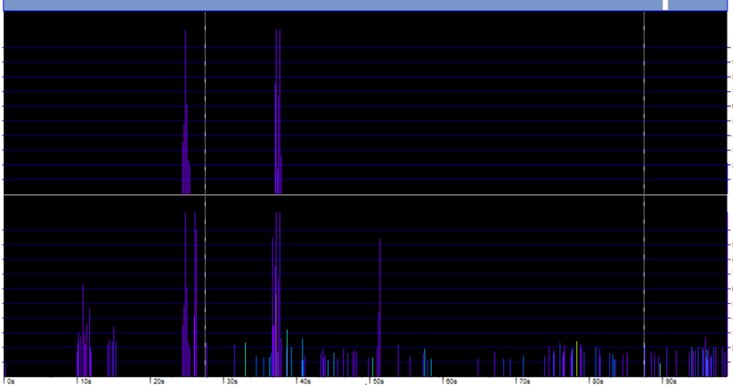

```{r, include = FALSE}
knitr::opts_chunk$set(
  collapse = TRUE,
  comment = "#>",
  warning = FALSE,
  message = FALSE
)
```

<!--- Insert image -->


<!--- Describe datatype in one or two sentences. -->
Permanent Cetacean passive acoustic sensor network in the Belgian part of the North Sea

- Partners: [Flanders Marine Institute (VLIZ)](https://www.vliz.be/en/imis?module=institute&insid=36), [Royal Belgian Institute of Natural Sciences (RBINS)](https://www.vliz.be/en/imis?module=institute&insid=1883)
- Period: since January 2016
- Geographical coverage: [Belgian Exclusive Economic Zone](https://www.marineregions.org/gazetteer.php?p=details&id=3293)
- Taxonomic coverage: Habour porpoises (_[Phocoena phocoena](https://www.marinespecies.org/aphia.php?p=taxdetails&id=137117)_), other cetaceans, abiotic (ships sonar)
- Moratorium: None
- Data quality: Research-grade
 
## How to interpret this dataset
 
### Query options
* **Processing**: Type of data: one of Raw or Validated
* **Timeframe**: Starting and stopping date for the query.
* **Quality**:  Level of processing: default Hi+Mod.
* **Sample period**: Counts aggregated. One of 1 week, 1 day or 60 min. Also per minute when choosing Processing = Raw.
 
### Available columns
* **deployment_fk**: Link to the deployment metadata in the European Tracking Network database
* **Time**: Time in UTC, beginning of sample time bin.
* **Species**: NBHF = Harbour porpoises (Phocoena phocoena); other cet = other cetaceans; Sonar = sonar 
* **Milliseconds**: Duration of click trains in the specified time bin.
* **Number_clicks_filtered**: recognized clicks of a species.
* **Number_clicks_total**: total number of recorded clicks.
* **Lost_minutes**: Minutes in which the number of clicks was larger than 4096.
* **Recorded**: Minutes recording.
* **Dpm**: Detection positive minutes, or a mammal was detected in that minute. A click train of the selected species was recorded in that minute.
* **Dph**: Detection positive hours, or a mammal was detected in that hour. A click train of the selected species was recorded in that hour.
* **Dpd**: Detection positive days, or a mammal was detected that day. A click train of the selected species was recorded in that day.
* **Dpw**: Detection positive weeks, or a mammal was detected that day. A click train of the selected species was recorded in that week.
* **Quality**: RAW: 3=high; 2= mod; 1=low; Hi+mod=3; Hi+mod+low =3; Validated = hi+mod = 4.
* **Projectname**: Name of the project.
* **Station**: name or code of sampling station or receiver code.
* **Latitude**: Center latitude in decimal degrees, WGS84.
* **Longitude**: Center longitude in decimal degrees, WGS84.
* **Mooring_type**: Surface-buoy or bottom-mooring.
* **Receiver**: Receiver: serial number of C-POD.

## Abstract
Data are presented from several passive acoustic projects in the Southern North Sea. The click detector (C-POD, Chelonia ctd.) records sequences of echolocation clicks of cetaceans and sonar clicks. Both are included in this database and can be selected as 'Species'. Click trains are classified by the KERNO classifier and harbour porpoises, sonar and other cetaceans (dolphins) can be identified, at the moment Other cetaceans are not yet included in this database. The data is offered as 'raw' or 'validated', the latter includes high and moderate quality click trains and is aggregated per hour. Only hours with a maximum of two minutes with lost data is incorporated. 

## How to cite these data

```{r get citation and license, results = 'asis', echo = FALSE}
library(jsonlite)

# Set base url 5251 4688
url <- "https://www.vliz.be/en/imis?module=dataset&dasid=5531"
dasid <- fromJSON(paste0(url, "&show=json"))

# Build citation. Get active DOI.
doi <- dasid[["dois"]]
doi <- subset(doi, doi$CurrentDOI == 1)$DOI
doi <- paste0("https://doi.org/", doi)
citation <- dasid[["datasetrec"]][["Citation"]]
citation <- paste0("> ", citation, " ", doi, 
                   ". Accessed through the LifeWatch Data Explorer / lwdataexplorer R package.")

# Get license
license <- dasid[["datasetrec"]][["AccConstrDisplay"]]
```

```{r display citation, results = 'asis', echo = FALSE}
cat(citation)
```

```{r display license, results = 'asis', echo = FALSE}
cat(paste0("<b>Availability:</b>", license))
```

Please acknowledge as: This work makes use of the LifeWatch observation data and infrastructure (provided by VLIZ) funded by Research Foundation - Flanders (FWO) as part of the Belgian contribution to LifeWatch.

These data are also available in the R language with the [lwdataxplorer package](https://lifewatch.github.io/lwdataexplorer/).

