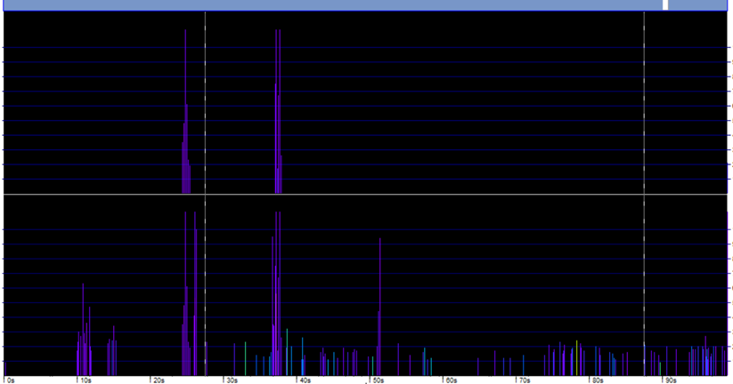

```{r, include = FALSE}
knitr::opts_chunk$set(
  collapse = TRUE,
  comment = "#>",
  warning = FALSE,
  message = FALSE
)
```



Permanent Cetacean passive acoustic sensor network in the Belgian part of the North Sea

- Partners: [Flanders Marine Institute (VLIZ)](https://www.vliz.be/en/imis?module=institute&insid=36), [Royal Belgian Institute of Natural Sciences (RBINS)](https://www.vliz.be/en/imis?module=institute&insid=1883)
- Period: since January 2016
- Geographical coverage: [Belgian Exclusive Economic Zone](https://www.marineregions.org/gazetteer.php?p=details&id=3293)
- Taxonomic coverage: Habour porpoises (_[Phocoena phocoena](https://www.marinespecies.org/aphia.php?p=taxdetails&id=137117)_), other cetaceans, abiotic (ships sonar)
- Moratorium: None
- Data quality: Research-grade
 
## How to interpret this dataset
 
### Query options
* **Processing**: Data processing. Currently only `Raw`.
* **Timeframe**: Starting and stopping date for the query.
* **Quality**: One or more of `Hi`, `Mod`, `Lo`.
* **Sample period**: Counts aggregated. Currently only `1 min`.
* **Project code**: One or more project codes to include in the query.
* **Species**: One or more of `Dolphins`, `NBHF`, or `sonar`.
 
### Available columns
* **deployment_fk**: Deployment ID, link to the deployment metadata in the European Tracking Network (ETN) database
* **species_preferences**: Species setting used during classification. Values: No_Dolphins, No_Sonar, No_Dolphins&Sonar, NA.
* **additional_classifier**: Additional classifier used during processing. Values: Default, Hel1, Genenc, advancedKerno, NA.
* **time**: Time (hh:mm:ss; 24 h, UTC) at the beginning of sample time bin
* **species**: Species as determined by cpod.exe, can be “NBHF”, “Dolphins”, “sonar”, or “Unclassed”
* **detections_bpm**: Buzz positive minute (BPM), detection of a high click repetition rate within a sampling minute (1 for detected, 0 for undetected)
* **milliseconds**: Duration of the logged train(s), in milliseconds
* **number_clicks_filtered**: Number of clicks classified as coming from the stated species at the specified time
* **number_clicks_total**: Total number of clicks at the specified time
* **lost_minutes**: Indicates the number of minutes in which the POD reached its threshold and therefore only recorded those minutes partially due to very high acoustic activity or noise
* **recorded**: Indicates whether the POD was actively recording at the specified time or not (1 = true, 0 = false)
* **dpm**: Indicates if an individual of the specified species or group of species was detected within a sampling minute (1 for detected, 0 for undetected)
* **angle**: Angle (°) at which the POD was oriented
* **temperature_min**: Minimum temperature recorded by the POD at the specified time
* **temperature_max**: Maximum temperature recorded by the POD at the specified time
* **quality**: Indicates the quality of click train classification; 3=High/High and moderate/High, moderate and low; 2= Moderate; 1=Low
* **projectcode**: Abbreviation of the project related to the deployment
* **projectname**: Name of the project related to the deployment
* **imis_dataset_id**: Dataset ID as specified in the Integrated Marine Information System (IMIS; https://marineinfo.org/en/imis)
* **station**: Refers to a unique location of a specific latitude and longitude
* **latitude**: Latitude of the actual deployment location, in decimal degrees
* **longitude**: Longitude of the actual deployment location, in decimal degrees
* **mooring_type**: Type of mooring to which the POD is attached. Predefined options: surface-buoy, bottom-mooring, surface-wind-turbine
* **receiver**: Model and serial number of the POD
* **deploy_date_time**: Date and time the POD was deployed, in 24-hour UTC (yyyy-mm-dd hh:mm:ss)
* **recover_date_time**: Date and time the POD was recovered, in 24-hour UTC (yyyy-mm-dd hh:mm:ss)
* **valid_data_until_datetime**: Data and time until which valid data was recorded, in 24-hour UTC (yyyy-mm-dd hh:mm:ss)

## Abstract
Data are presented from several passive acoustic projects in the Southern North Sea. The click detector (C-POD, Chelonia ctd.) records sequences of echolocation clicks of cetaceans and sonar clicks. Both are included in this database and can be selected as 'Species'. Click trains are classified by the KERNO classifier and harbour porpoises, sonar and other cetaceans (dolphins) can be identified, at the moment Other cetaceans are not yet included in this database. The data is offered as 'raw' or 'validated', the latter includes high and moderate quality click trains and is aggregated per hour. Only hours with a maximum of two minutes with lost data is incorporated. 

## How to cite these data

```{r get citation and license, results = 'asis', echo = FALSE}
library(jsonlite)

# Set base url 5251 4688
url <- "https://www.vliz.be/en/imis?module=dataset&dasid=5531"
dasid <- fromJSON(paste0(url, "&show=json"))

# Build citation. Get active DOI.
doi <- dasid[["dois"]]
doi <- subset(doi, doi$CurrentDOI == 1)$DOI
doi <- paste0("https://doi.org/", doi)
citation <- dasid[["datasetrec"]][["Citation"]]
citation <- paste0("> ", citation, " ", doi, 
                   ". Accessed through the LifeWatch Data Explorer / lwdataexplorer R package.")

# Get license
license <- dasid[["datasetrec"]][["AccConstrDisplay"]]
```

```{r display citation, results = 'asis', echo = FALSE}
cat(citation)
```

```{r display license, results = 'asis', echo = FALSE}
cat(paste0("<b>Availability:</b>", license))
```

Please acknowledge as: This work makes use of the LifeWatch observation data and infrastructure (provided by VLIZ and RBINS) funded by Research Foundation - Flanders (FWO) as part of the Belgian contribution to LifeWatch.

These data are also available in the R language with the [lwdataxplorer package](https://lifewatch.github.io/lwdataexplorer/).

