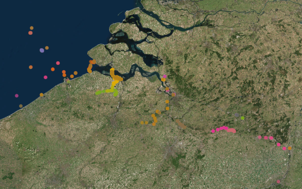

<h1>Exploring fish telemetry data</h1>

```{r, include = FALSE}
knitr::opts_chunk$set(
  collapse = TRUE,
  comment = "#>",
  warning = FALSE,
  message = FALSE
)
```
<!--- Insert image -->


<!--- Describe datatype in one or two sentences. -->
Aquatic animal tracking data from the [European Tracking Network](https://lifewatch.be/etn/).

- Partners: ETN members
- Period: since January 2003
- Geographical coverage: Europe
- Taxonomic coverage: [Pisces](http://www.marinespecies.org/aphia.php?p=taxdetails&id=11676)
- Moratorium: Some project data is under moratorium. Login or [register](https://rshiny.lifewatch.be/account?p=register) to get full access
- Data quality: Research-grade
 
## How to interpret this dataset
 
### Query options
* **Data Source**: One of: **Time bins**: Number of detections per tag and per station based on the selected sample period; **Residencies**: groups detections by period spent at each receiver and sampling frequency; or **Active network**: list of active deployments, in which case time = start of deployment.
* **Network**: The network of receiver or antenna deployments.
* **Project**: Animal project linked to the tag deployments.
* **Sample period**: Counts aggregated. One of 1 week, 1 day, 60 min, 10 min or 1 min.
* **Timeframe**: Starting and stopping date for the query.

### Available columns
* **Counts**: Total GPS fixes or detections.
* **Scientific_name**: The latin name of the species.
* **Project**: Project in charge of receiver deployments.
* **Network**: The network of receiver or antenna deployments.
* **Time**: Time in UTC, beginning of sample timeperiod.
* **Longitude**: Center longitude in decimal degrees, WGS84
* **Latitude**: Center latitude in decimal degrees, WGS84
* **Station**: Name or code of sampling station or receiver code.
* **Receiver**: Receiver name, composed of 'Model number'-'Serial number'.
* **Code**: Code of device on / in individual.
* **Moratorium**: Some data fields are masked, pending official data publication. eg Species name.
* **Duration**: Total time since receiver deployment (in hours).
* **Remaining**: Battery life remaining in the receiver (in hours). 
* **Expiry_date**: As in 'BATTERY_ESTIMATED_END_DATE' is the estimated date at which receiver will stop recording. This date is calculated automatically from (Deployments/Battery install date) and (Receivers/Expected battery life).
* **Location_name**: Name of receiver location. Please refer to a specific nearby point of land, town, island, or body of water that uniquely identifies this receiver location.
* **Residency**: Time in hours that an animal was present at a station.     
* **Absence**: Time in hours that an animal was not detected at a station (calculated between end of previous residence and start of current residence period).       
* **Species**: Scientific name of the animal, as in Gadus morhua.  
* **Endperiod**:  Last time that the animal was present at a station during the current residency period.    

<details>
  <summary>Click to see all the columns of "Detections"</summary>
	<ul>
		<li><strong>Transmitter</strong>: Transmitter full-id (including both protocol and transmitter ID)  </li> 
		<li><strong>Transmitter_serial</strong>: Serial number of the transmitter.     </li> 
		<li><strong>Sensor_value</strong>:  Value recorded by the tag sensor.   </li>          
		<li><strong>Sensor_unit</strong>: Unit of measured sensor value.       </li>      
		<li><strong>Station_name</strong>: Name of the station where the deployment of the receiver takes place. Related to a specific latitude and longitude.       </li>  
		<li><strong>Datetime</strong>: Date and time at which the tagged animal was detected at the receiver. Information from detection file.      </li>           
		<li><strong>Id_pk</strong>: Technical identifier of the detection record in the database.     </li>               
		<li><strong>Qc_flag</strong>: Identifies whether there are quality check issues for the given detection.  </li>         
		<li><strong>File</strong>: Name of the detection file.            </li>      
		<li><strong>Deployment_fk</strong>: Foreign key linked to the deployment information. </li>   
		<li><strong>Scientific_name</strong>: Scientific name of the animal that carries the tag. </li>         
		<li><strong>Location_name</strong>: Name of detection location.</li>           
		<li><strong>Deployment_station_name</strong>: Name of the station where the deployment of the receiver takes place. Related to a specific latitude and longitude. </li> 
		<li><strong>Deploy_date_time</strong>: Date and time that the equipment was deployed, in 24-hour UTC. Corresponds to the time of the captured waypoint. Datetime fields should follow the ISO-8601 format (e.g. 2017-01-01T12:07:23Z)</li>      
		<li><strong>Deployment_type</strong>: Refers to the context. Which technology type is used. </li>         
		<li><strong>Animal_project_name</strong>: Name of the animal project linked to this detection.</li>      
		<li><strong>Animal_project_code</strong>: Code of the animal project linked to this detection.  </li>    
		<li><strong>Animal_moratorium</strong>: Specifies whether data from the animal project is under moratorium.  </li>     
		<li><strong>Network_project_name</strong>: Name of the network project linked to this detection.     </li>
		<li><strong>Network_project_code</strong>: Code of the network project linked to this detection.   </li>  
		<li><strong>Network_moratorium</strong>: Specifies whether data from the network project is under moratorium.</li>       
		<li><strong>Signal_to_noise_ratio</strong>: Signal-to-noise ratio. This is the difference between the background noise level and the signal level. Info comes from detection file.   </li> 
		<li><strong>Detection_file_id</strong>: ID from the detection file.  </li>       
		<li><strong>Tag_sensor_type</strong>: What type of sensor (pressure, acceleration). </li>
		<li><strong>Tag_intercept</strong>: Intercept needed to calculate the sensor value of the tag from the raw value.</li>
		<li><strong>Tag_slope</strong>: Slope needed to calculate the sensor value of the tag from the raw value.</li>
		<li><strong>Sensor_value_depth_meters</strong>: Calculated depth of the sensor in meters (based on raw value slope and intercept).</li>
		<li><strong>Tag_owner_organization</strong>: Institution that owns the tag. </li> 
		<li><strong>Animal_id_pk</strong>: Technical identifier of the animal record in the database. </li>           
		<li><strong>Animal_common_name</strong>: Animal species common name (not scientific name).</li>
		<li><strong>Animal_sex</strong>: Sex of the animal.</li>
		<li><strong>Deployment_lat</strong>: Latitude of the deployment in decimal degrees, WGS84. Note: in the southern hemisphere all latitudes must be negative. Format: ddd.ddddd; as in: 2.59020.</li>
		<li><strong>Deployment_long</strong>: Longitude of the deployment in decimal degrees, WGS84. Note: in the western hemisphere all longitudes must be negative. Format: dd.ddddd; as in: 51.36324. </li>        
		<li><strong>Sensor_value_acceleration</strong>: Value recorded by the acceleration sensor.</li> 
		<li><strong>Sensor_value_temperature</strong>: Value recorded by the temperature sensor. </li>
		<li><strong>Tag_fk</strong>: Foreign key linked to the tag. </li>
		<li><strong>Animal_id</strong>: Foreign Key linked to the Animal_ID.</li>
	</ul>


</details>

## Abstract

```{r abstract, results = 'asis', echo = FALSE}
# Get the abstract and/or description from IMIS and print here
library(jsonlite)

dasid <- fromJSON("https://www.vliz.be/en/imis?module=dataset&dasid=5912&show=json")

abstract <- dasid[["datasetrec"]][["EngAbstract"]]
description <- dasid[["datasetrec"]][["EngDescr"]]

if (is.null(abstract) & is.null(description)){

} else if(is.null(abstract) & !is.null(description)){
  out <- description
} else if(!is.null(abstract) & is.null(description)){
  out <- abstract
} else if(!is.null(abstract) & !is.null(description)){
  out <- paste0(abstract, "</br></br>", description)
}

cat(out)
```

The ETN Data Explorer provides a set of  functions to access the aquatic animal tracking data and metadata linked to the European Tracking Network (ETN). As the access to data is linked to specific user profiles, keep in mind that the results can be different for other users and login is needed to access data under moratorium.

## How to cite these data

```{r get citation and license, results = 'asis', echo = FALSE}
library(jsonlite)

# Set base url
url <- "https://www.vliz.be/en/imis?module=dataset&dasid=5912"
dasid <- fromJSON(paste0(url, "&show=json"))

# Build citation. Get active DOI.
citation <- dasid[["datasetrec"]][["Citation"]]
citation <- paste0("> ", citation, " ", url, 
                   ". Accessed through the LifeWatch Data Explorer / lwdataexplorer R package.")

# Get license
license <- dasid[["datasetrec"]][["AccConstrDisplay"]]
```

```{r display citation, results = 'asis', echo = FALSE}
cat(citation)
```

```{r display license, results = 'asis', echo = FALSE}
cat(paste0("<b>Availability:</b>", license))
```

Please acknowledge as: This work makes use of the LifeWatch observation data and infrastructure (provided by the ETN partners) funded by Research Foundation - Flanders (FWO) as part of the Belgian contribution to LifeWatch.

These data are also available in the R language with the [lwdataxplorer package](https://lifewatch.github.io/lwdataexplorer/).
