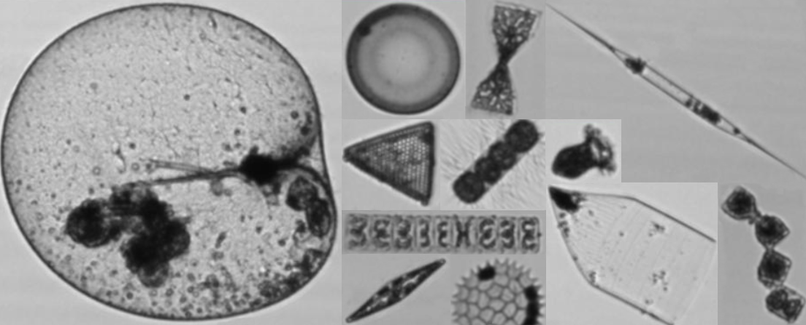

<h1>Exploring microplankton data: FlowCam</h1>

```{r, include = FALSE}
knitr::opts_chunk$set(
  collapse = TRUE,
  comment = "#>",
  warning = FALSE,
  message = FALSE
)
```

<!-- Insert image -->


<!-- Describe datatype in one or two sentences. -->
Biodiversity data on microplankton in the Belgian part of the North Sea

- Partners: [Flanders Marine Institute (VLIZ)](https://www.vliz.be/en/imis?module=institute&insid=36)
- Period: since May 2017
- Geographical coverage: [Belgian Exclusive Economic Zone](https://www.marineregions.org/gazetteer.php?p=details&id=3293)
- Taxonomic coverage: Microplankton, being a substantial part of phytoplankton. Find the complete list in [this sheet](https://lifewatch.be/sites/lifewatch.be/files/public/metadata_taxonomy.pdf)
- Moratorium: None
- Data quality: Calibrated/Validated
 
## How to interpret this dataset
 
### Query options
* **Timeframe**: Starting and stopping date for the query.
 
### Available columns
* **Tripaction**: Unique identifier to recognize actions taken aboard the RV Simon Stevin.
* **Time**: Time in UTC, beginning of sample timeperiod.
* **Station**: Name or code of sampling station or receiver code.
* **Longitude**: Center longitude in decimal degrees, WGS84.
* **Latitude**: Center latitude in decimal degrees, WGS84.
* **Fluid Volume Imaged (ml)**: Total volume of subsample processed with the FlowCAM in mililitres.
* **Sample Volume (ml)**: Total volume of the water sample in mililitres.
* **Volume Filtered (l)**: Total volume of water filtered through the Apstein net in mililitres.
* **Sample Dilution Factor**: Dilution factor of the processed sample to obtain Particles Per Used Image (PPUI). Values between 1.10 to 1.20. 
* **Taxon**: Taxonomic group of organisms or group of artefacts.
* **Count**: The exact number of specimens counted.
* **Total Count**: The exact number of specimens counted in the sample.
* **Density (cell/l)**: Number of specimens per litre<sup>1</sup>.
* **ActionType**: The type of sampling equipment.
* **Project**: Project in charge of receiver deployments.


## Abstract

```{r abstract, results = 'asis', echo = FALSE}
# Get the abstract and/or description from IMIS and print here
library(jsonlite)

dasid <- fromJSON("https://www.vliz.be/en/imis?module=dataset&dasid=4688&show=json")

abstract <- dasid[["datasetrec"]][["EngAbstract"]]
description <- dasid[["datasetrec"]][["EngDescr"]]

if (is.null(abstract) & is.null(description)){
  
} else if(is.null(abstract) & !is.null(description)){
  out <- description
} else if(!is.null(abstract) & is.null(description)){
  out <- abstract
} else if(!is.null(abstract) & !is.null(description)){
  out <- paste0(abstract, "</br>", description)
}

cat(out)
```

Further information can be found in [this link](https://lifewatch.be/en/flowcam) or in a Data Paper: [LifeWatch observatory data: phytoplankton observations in the Belgian Part of the North Sea](https://bdj.pensoft.net/article/57236/).

At the moment, corrections are being made to the FlowCAM dataset and pipeline. Most up-to-date information on sampling or processing protocols and taxonomic information of the classes used during validations can be found in the following links:

* [Sampling and processing protocols](https://lifewatch.be/sites/lifewatch.be/files/public/metadata_sampling_processing.pdf)
* [Taxonomic information](https://lifewatch.be/sites/lifewatch.be/files/public/metadata_taxonomy.pdf)


## How to cite these data

```{r get citation and license, results = 'asis', echo = FALSE}
library(jsonlite)

# Set base url 5251 4688
url <- "https://www.vliz.be/en/imis?module=dataset&dasid=4688"
dasid <- fromJSON(paste0(url, "&show=json"))

# Build citation. Get active DOI.
doi <- dasid[["dois"]]
doi <- subset(doi, doi$CurrentDOI == 1)$DOI
doi <- paste0("https://doi.org/", doi)
citation <- dasid[["datasetrec"]][["Citation"]]
citation <- paste0("> ", citation, " ", doi, 
                   ". Accessed through the LifeWatch Data Explorer / lwdataexplorer R package."
                   )

# Get license
license <- dasid[["datasetrec"]][["AccConstrDisplay"]]
```

```{r display citation, results = 'asis', echo = FALSE}
cat(citation)
```

```{r display license, results = 'asis', echo = FALSE}
cat(paste0("<b>Availability:</b>", license))
```

Please acknowledge as: This work makes use of the LifeWatch observation data and infrastructure (provided by VLIZ) funded by Research Foundation - Flanders (FWO) as part of the Belgian contribution to LifeWatch.

These data are also available in the R language with the [lwdataxplorer package](https://lifewatch.github.io/lwdataexplorer/).


</br>
<small><sup>1</sup> The formula linked in the [datapaper](https://bdj.pensoft.net/article/57236/) that describes these data is not used anymore. The corrected formula used during the aggregations is:</small></br>

$$Density = \frac{ConcentrationSample * SampleVolume(L)}{VolumeFiltered(L)}$$
$$Density = \frac{Count * SampleVolume(L)}{FluidVolumeImaged(L)*VolumeFiltered(L)*SampleDilutionFactor}$$

