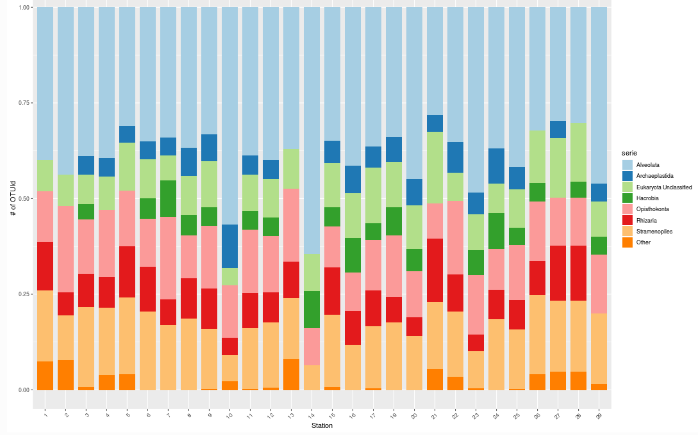

```{r, include = FALSE}
knitr::opts_chunk$set(
  collapse = TRUE,
  comment = "#>",
  warning = FALSE,
  message = FALSE
)
```

<!--- Insert image -->


<!-- Describe datatype in one or two sentences. -->
Genomic observations in the Belgian Part of the North Sea.

- Partners: [Flanders Marine Institute (VLIZ)](https://www.vliz.be/en/imis?module=institute&insid=36)
- Period: since June 2012
- Geographical coverage: [Belgian Exclusive Economic Zone](https://www.marineregions.org/gazetteer.php?p=details&id=3293)
- Taxonomic coverage: Several Bacteria and Eukaryota phylums.
- Moratorium: None
- Data quality: Unknown
 
## How to interpret this dataset
 
### Query options
* **Timeframe**: Starting and stopping date for the query.

### Available columns

* **Project**: Project in charge of sampling.
* **Station**: Name or code of sampling station.
* **TripAction**:	Unique identifier to recognize actions taken aboard the RV Simon Stevin.
* **ActionType**: The type of sampling equipment.
* **OTUId**: Unique identifier for each Operational Taxonomic Unit (OTU)
* **Sequences**: Amount of sequences assigned to Operational Taxonomic Unit (OTU).
* **MarkerGene**: Marker gene that was used for barcoding.
* **Time**: Time in UTC, beginning of sample timeperiod.
* **Longitude**: Center longitude in decimal degrees, WGS84.
* **Latitude**: Center latitude in decimal degrees, WGS84.
* **Domain**:	Taxonomic group Domain.
* **SuperPhylum**:	Taxonomic group SuperPhylum.
* **Phylum**:	Taxonomic group Phylum.
* **Class**:	Taxonomic group Class.
* **Order**:	Taxonomic group Order.
* **Family**:	Taxonomic group Family.
* **Genus**: Taxonomic group Genus.
* **Species**: Taxonomic group of organisms or group of artefacts.	
* **AphiaID**: Unique and persistent identifier of the taxon in [marinespecies.org](https://www.marinespecies.org/) (WoRMS).

## Abstract

```{r abstract, results = 'asis', echo = FALSE}
# Get the abstract and/or description from IMIS and print here
library(jsonlite)

dasid <- fromJSON("https://www.vliz.be/en/imis?module=dataset&dasid=5188&show=json")

abstract <- dasid[["datasetrec"]][["EngAbstract"]]
description <- dasid[["datasetrec"]][["EngDescr"]]

if (is.null(abstract) & is.null(description)){
  
} else if(is.null(abstract) & !is.null(description)){
  out <- description
} else if(!is.null(abstract) & is.null(description)){
  out <- abstract
} else if(!is.null(abstract) & !is.null(description)){
  out <- paste0(abstract, "</br>", description)
}

cat(out)
```

## How to cite these data

When using this tool, please acknowledge the LifeWatch Data Explorer in your work with the statment written below. Please also acknowledge the individual datasets used and mind their individual licenses: Find the complete list in this link to the [IMIS metadata record](https://www.lifewatch.be/en/imis?module=dataset&dasid=5188) of this data type.

> _This work makes use of the LifeWatch Data Explorer provided by VLIZ and funded by Research Foundation - Flanders (FWO) as part of the Belgian contribution to LifeWatch._

</br>
If you retrieved these data using the [LifeWatch Data Explorer R package](https://github.com/lifewatch/lwdataexplorer/), you should also cite it as: 

```{r citation, results = 'asis', echo = FALSE}
cat(paste0("> ", citation("lwdataexplorer")$textVersion))
```
