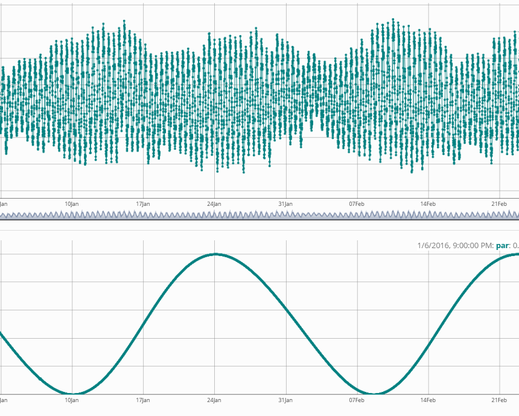

<h1>Exploring Meetnet Vlaamse Banken data</h1>

```{r, include = FALSE}
knitr::opts_chunk$set(
  collapse = TRUE,
  comment = "#>",
  warning = FALSE,
  message = FALSE
)
```

<!-- Insert image -->


<!-- Describe datatype in one or two sentences. -->
Hydrometeo data collected at stations along the Belgian coast and off-shore along the Flemish Banks.

- Partners: [Vlaamse Hydrografie (MOW)](http://www.vliz.be/en/imis?module=institute&insid=7831), [Flanders Marine Institute (VLIZ)](https://www.vliz.be/en/imis?module=institute&insid=36)
- Period: since September 2001
- Geographical coverage: [Belgian Exclusive Economic Zone](https://www.marineregions.org/gazetteer.php?p=details&id=3293)
- Taxonomic coverage: Abiotic data only
- Moratorium: Without valid credentials you are only allowed to view the "Tide TAW" parameter for the last 30 days, grouped by day/hour. Login or [register](https://rshiny.lifewatch.be/account?p=register) to get full access.
- Data quality: Research-grade
 
## How to interpret this dataset
 
### Query options
* **Parameters**: List available parameters for Meetnet Vlaamse Banken (MVB).
* **Timeframe**: Starting and stopping date for the query.
* **Stations**: Name or code of sampling station or receiver code.
* **Calculate**: Calculation to perform given time grouping, one of ('avg', 'max', 'min', 'none').
* **by**: Time grouping for calculation, one of ('day','hour', '10min' ,'none').
 
### Available columns
* **Time**: Time in UTC, beginning of sample timeperiod.
* **Station**: Name or code of sampling station or receiver code.
* **Longitude**: Center longitude in decimal degrees, WGS84.
* **Latitude**: Center latitude in decimal degrees, WGS84.
* **Tide TAW**: Waterlevel in m, level TAW <sup>1</sup> measured in Ostend at the time

<details>
  <summary>Click to see the columns available after log in</summary>
  <ul>
    <li><strong>1% wave height</strong></li>
    <li><strong>10 % wave height</strong></li>
    <li><strong>10% highest waves</strong></li>
    <li><strong>Air pressure</strong></li>
    <li><strong>Air temperature</strong></li>
    <li><strong>Average current direction</strong></li>
    <li><strong>Average current velocity</strong></li>
    <li><strong>Average wave period</strong></li>
    <li><strong>Average wind direction</strong></li>
    <li><strong>Average wind speed (at sensor height)</strong></li>
    <li><strong>Average wind speed at 10 m</strong></li>
    <li><strong>Average Windspeed</strong></li>
    <li><strong>Ground temperature</strong></li>
    <li><strong>Height waves with period > 10 s</strong></li>
    <li><strong>High frequent wave direction</strong></li>
    <li><strong>Low frequent wave direction</strong></li>
    <li><strong>Max 1 sec gust of wind at 10 m</strong></li>
    <li><strong>Max 3 sec gust of wind (at sensor height).</strong></li>
    <li><strong>Max 3 sec wind speed at 10 m</strong></li>
    <li><strong>Max 3 sec Windgust</strong></li>
    <li><strong>Max. windspeed at 10m</strong></li>
    <li><strong>Precipitation</strong></li>
    <li><strong>Relative humidity</strong></li>
    <li><strong>Sea water temperature</strong></li>
    <li><strong>Significant wave height</strong></li>
    <li><strong>Significant wave height - bouys</strong></li>
    <li><strong>Solar radiation</strong></li>
    <li><strong>Wave height</strong></li>
    <li><strong>Wet bulb Temperature</strong></li>
  </ul>
</details>

## Abstract

```{r abstract, results = 'asis', echo = FALSE}
# Get the abstract and/or description from IMIS and print here
library(jsonlite)

dasid <- fromJSON("https://www.vliz.be/en/imis?module=dataset&dasid=59&show=json")

abstract <- dasid[["datasetrec"]][["EngAbstract"]]
description <- dasid[["datasetrec"]][["EngDescr"]]

if (is.null(abstract) & is.null(description)){

} else if(is.null(abstract) & !is.null(description)){
  out <- description
} else if(!is.null(abstract) & is.null(description)){
  out <- abstract
} else if(!is.null(abstract) & !is.null(description)){
  out <- paste0(abstract, "</br>", description)
}

cat(out)
```

You can find more information at: https://www.vliz.be/en/imis?module=dataset&dasid=59

## How to cite these data 
<!-- 
```{r get citation and license, results = 'asis', echo = FALSE}
library(jsonlite)

# Set base url 5251 4688
url <- "https://www.vliz.be/en/imis?module=dataset&dasid=59"
dasid <- fromJSON(paste0(url, "&show=json"))

# Build citation. Get active DOI.
citation <- dasid[["datasetrec"]][["Citation"]]
citation <- paste0("> ", citation, " ", url, 
                   ". Accessed through the LifeWatch Data Explorer / lwdataexplorer R package."
                   )

# Get license
license <- dasid[["datasetrec"]][["AccessConstraint"]]
```

```{r display citation, results = 'asis', echo = FALSE}
cat(citation)
```

```{r display license, results = 'asis', echo = FALSE}
cat(paste0("<b>Availability: </b>", license))
```
-->
Please acknowledge as: This work makes use of the LifeWatch observation data and infrastructure (provided by MOW and VLIZ) funded by Research Foundation - Flanders (FWO) as part of the Belgian contribution to LifeWatch.

These data are also available in the R language with the [lwdataxplorer package](https://lifewatch.github.io/lwdataexplorer/).

</br>
<small><sup>1</sup> TAW (from Dutch: _Tweede Algemeene Waterpassing_) is a term used only in Belgium; it is a horizontal water level reference level. Source: [proz.com](https://www.proz.com/kudoz/dutch-to-english/ships-sailing-maritime/2504584-tweede-algemeene-waterpassing.html)</small>
