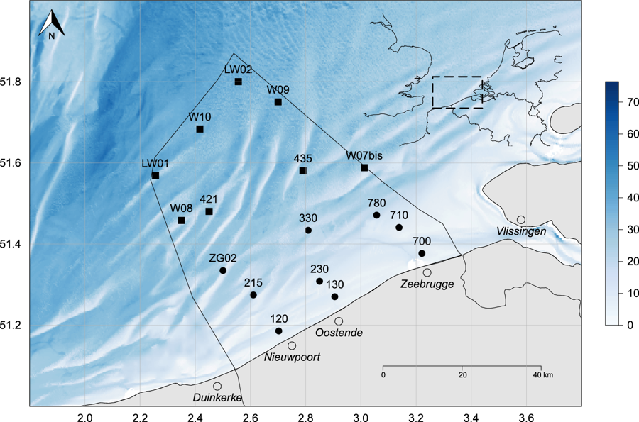

```{r, include = FALSE}
knitr::opts_chunk$set(
  collapse = TRUE,
  comment = "#>",
  warning = FALSE,
  message = FALSE
)
```

<!-- Insert image -->


<!--- Describe datatype in one or two sentences. -->
Data on nutrients, pigments, suspended matter and secchi measurements from fixed stations on the Belgian Part of the North Sea.

- Partners: [Flanders Marine Institute (VLIZ)](https://www.vliz.be/en/imis?module=institute&insid=36),[Laboratory of Protistology and Aquatic Ecology (PAE)](https://www.vliz.be/en/imis?module=institute&insid=732) and [Flemish Environment Agency (VMM)](https://www.vliz.be/en/imis?module=institute&insid=2204). Former partners: Directorate Natural Environment (OD Natuur), [Royal Netherlands Institute for Sea Research (NIOZ)](https://www.vliz.be/en/imis?module=institute&insid=397), [National Oceanography Centre Southampton (NOCS)](https://www.vliz.be/en/imis?module=institute&insid=2045), [Marine Biology Research Group (MARBIOL)](https://www.vliz.be/en/imis?module=institute&insid=13)
- Period: since April 2001
- Geographical coverage: [Belgian Exclusive Economic Zone](https://www.marineregions.org/gazetteer.php?p=details&id=3293)
- Taxonomic coverage: Abiotic data only
- Moratorium: None
- Data quality: Research-grade. Pigment, nutrients and spm are subjected to an automated QC while the CTD data is not.

## How to interpret this dataset
 
### Query options
* **Timeframe**: Starting and stopping date for the query.
* **Parameter categories**: Type of parameters to request. Available: SPM, CTD, Nutrients, Secchi, Pigments.
 
### Available columns
* **Station**: Name or code of sampling station or receiver code.
* **Time**: Time in UTC, beginning of sample timeperiod.
* **Latitude**: Center latitude in decimal degrees, WGS84.
* **Longitude**: Center longitude in decimal degrees, WGS84.

<details>
  <summary>Click to see all the columns available: </summary>
  
* **X19But_Fucoxanthin(µg/L)**:  Concentration of 19'-butanoyloxyfucoxanthin per unit volume of the water body [particulate >GF/F phase] by filtration, acetone extraction and high performance liquid chromatography (HPLC); [BUTAHPP1](https://vocab.nerc.ac.uk/collection/P01/current/BUTAHPP1/).
* **X19Hex_Fucoxanthin(µg/L)**: Concentration of 19'-hexanoyloxyfucoxanthin {CAS 60147-85-5} per unit volume of the water body [particulate >GF/F phase] by filtration, acetone extraction and high performance liquid chromatography (HPLC); [HEXOHPP1](https://vocab.nerc.ac.uk/collection/P01/current/HEXOHPP1/).
* **Alloxanthin(µg/L)**: Concentration of alloxanthin {CAS 28380-31-6} per unit volume of the water body [particulate >GF/F phase] by filtration, acetone extraction and high performance liquid chromatography (HPLC); [ALLOHPP1](https://vocab.nerc.ac.uk/collection/P01/current/ALLOHPP1/).
* **Ammonium_NH4(µmol.N_NH4/L)**: Concentration of ammonium {NH4+ CAS 14798-03-9} per unit volume of the water body by filtration and colorimetric autoanalysis; [AMONAAD5](https://vocab.nerc.ac.uk/collection/P01/current/AMONAAD5/)
* **Antheraxanthin(µg/L)**: Concentration of antheraxanthin {CAS 640-03-9} per unit volume of the water body [particulate >GF/F phase] by filtration, acetone extraction and high performance liquid chromatography (HPLC); [ANTHHPP1](https://vocab.nerc.ac.uk/collection/P01/current/ANTHHPP1/).
* **Anthoxanthin(µg/L)**: Concentration of anthoxanthins {flavones+flavonols} per unit volume of the water body [particulate >GF/F phase] by filtration, acetone extraction and high performance liquid chromatography (HPLC); [ATHXHPP1](https://vocab.nerc.ac.uk/collection/P01/current/ATHXHPP1/).
* **Astaxanthine(µg/L)**: Concentration of astaxanthin {CAS 472-61-7} per unit volume of the water body [particulate >GF/F phase] by filtration, acetone extraction and high performance liquid chromatography (HPLC); [ASTAXHP1](https://vocab.nerc.ac.uk/collection/P01/current/ASTAXHP1/).
* **Beta_Carotene(µg/L)**: Concentration of beta, beta-carotene {beta-carotene CAS 7235-40-7} per unit volume of the water body [particulate >GF/F phase] by filtration, acetone extraction and high performance liquid chromatography (HPLC); [BBCAHPP1](https://vocab.nerc.ac.uk/collection/P01/current/BBCAHPP1/).
* **Chlorophyll_a(µg/L)**: Concentration of chlorophyll-a {chl-a CAS 479-61-8} per unit volume of the water body [particulate >GF/F phase] by filtration, acetone extraction and high performance liquid chromatography (HPLC); [CPHLHPP1](https://vocab.nerc.ac.uk/collection/P01/current/CPHLHPP1/).
* **Chlorophyll_b(µg/L)**: Concentration of chlorophyll-b {chl-b CAS 519-62-0} per unit volume of the water body [particulate >GF/F phase] by filtration, acetone extraction and high performance liquid chromatography (HPLC); [CHLBHPP1](https://vocab.nerc.ac.uk/collection/P01/current/CHLBHPP1/).
* **Chlorophyll_c2c1(µg/L)**: Concentration of chlorophyll-c2 {chl-c2} per unit volume of the water body [particulate >GF/F phase] by filtration, acetone extraction and high performance liquid chromatography (HPLC); [CLC2HPP1](https://vocab.nerc.ac.uk/collection/P01/current/CLC2HPP1/).
* **Chlorophyll_c2(µg/L)**: Concentration of chlorophyll-c1+c2 per unit volume of the water body [particulate >GF/F phase] by filtration, acetone extraction and high performance liquid chromatography (HPLC); [C1C2HPP1](https://vocab.nerc.ac.uk/collection/P01/current/C1C2HPP1/).
* **Chlorophyll_c3(µg/L)**: Concentration of chlorophyll-c3 {chl-c3} per unit volume of the water body [particulate >GF/F phase] by filtration, acetone extraction and high performance liquid chromatography (HPLC); [CLC3HPP1](https://vocab.nerc.ac.uk/collection/P01/current/CLC3HPP1/).
* **Chlorophyllide_a(µg/L)**: Concentration of chlorophyllide-a {CAS 14897-06-4} per unit volume of the water body [particulate >GF/F phase] by filtration, acetone extraction and high performance liquid chromatography (HPLC); [CIDAHPP1](https://vocab.nerc.ac.uk/collection/P01/current/CIDAHPP1/).
* **Conductivity(µS/cm)**: Electrical conductivity standard deviation of the water body by CTD, expressed in degrees µS/cm.
* **CPAR**: Corrected Photosynthetic Active Radiation of the water body.
* **Density(kg/m3)**: The density of the water body, expressed in kg/m³.
* **Diadinoxanthin(µg/L)**: Concentration of diadinoxanthin {CAS 18457-54-0} per unit volume of the water body [particulate >GF/F phase] by filtration, acetone extraction and high performance liquid chromatography (HPLC); [DIADHPP1](https://vocab.nerc.ac.uk/collection/P01/current/DIADHPP1/).
* **Diatoxanthin(µg/L)**: Concentration of diatoxanthin {CAS 31063-73-7} per unit volume of the water body [particulate >GF/F phase] by filtration, acetone extraction and high performance liquid chromatography (HPLC); [DIATHPP1](https://vocab.nerc.ac.uk/collection/P01/current/DIATHPP1/).
* **Echinenone(µg/L)**: Concentration of echinenone {CAS 432-68-8} per unit volume of the water body [particulate >GF/F phase] by filtration, acetone extraction and high performance liquid chromatography (HPLC); [ECHNHPP1](https://vocab.nerc.ac.uk/collection/P01/current/ECHNHPP1/).
* **Fluorescence(mg/m³)**: Fluorescence of the water body, expressed in mg/m³.
* **Fucoxanthin(µg/L)**: Concentration of fucoxanthin {CAS 3351-86-8} per unit volume of the water body [particulate >GF/F phase] by filtration, acetone extraction and high performance liquid chromatography (HPLC); [FUCXHPP1](https://vocab.nerc.ac.uk/collection/P01/current/FUCXHPP1/).
* **Lutein(µg/L)**: Concentration of lutein {CAS 127-40-2} per unit volume of the water body [particulate >GF/F phase] by filtration, acetone extraction and high performance liquid chromatography (HPLC); [LUTNHPP1](https://vocab.nerc.ac.uk/collection/P01/current/LUTNHPP1/).
* **Neoxanthin(µg/L)**: Concentration of neoxanthin {CAS 30743-41-0} per unit volume of the water body [particulate >GF/F phase] by filtration, acetone extraction and high performance liquid chromatography (HPLC); [NEOXHPP1](https://vocab.nerc.ac.uk/collection/P01/current/NEOXHPP1/).
* **Nitrate_Nitrite(µmolN_NO3-NO2/L)**: Concentration of nitrates+ nitrites in the water body, expressed in µmol N_NO3-NO2/L; [NTRZAAD5](https://vocab.nerc.ac.uk/collection/P01/current/NTRZAAD5/).
* **Nitrate_NO3(µmolN_NO3/L)**: Concentration of nitrate in the water body, expressed in µmol N_NO3/L; [ODSDM2UM](https://vocab.nerc.ac.uk/collection/P01/current/ODSDM2UM/).
* **Nitrite_NO2(µmolN_NO2/L)**: Concentration of nitrites in the water body, expressed in µmol N_NO2/L; [NTRIAAD5](https://vocab.nerc.ac.uk/collection/P01/current/NTRIAAD5/).
* **OBS(NTU)**: Optical backscatter as turbidity of the water body, expressed in Nephelometric Turbidity Units.
* **PAR**: Photosynthetic Active Radiation.
* **Peridinin(µg/L)**: Concentration of peridinin {CAS 33281-81-1} per unit volume of the water body [particulate >GF/F phase] by filtration, acetone extraction and high performance liquid chromatography (HPLC); [PERIHPP1](https://vocab.nerc.ac.uk/collection/P01/current/PERIHPP1/).
* **Ph**: Acidity of the water body.
* **Pheophorbide_a(µg/L)**: Concentration of phaeophorbide-a {pheophorbide-a CAS 15664-29-6} per unit volume of the water body [particulate >GF/F phase] by filtration, acetone extraction and high performance liquid chromatography (HPLC); [PBAXHPP1](https://vocab.nerc.ac.uk/collection/P01/current/PBAXHPP1/).
* **Pheophytin_a(µg/L)**: Concentration of phaeophytin-a {pheophytin-a CAS 603-17-8} per unit volume of the water body [particulate >GF/F phase] by filtration, acetone extraction and high performance liquid chromatography (HPLC); [PTAXHPP1](https://vocab.nerc.ac.uk/collection/P01/current/PTAXHPP1/).
* **Pheophytin_b(µg/L)**: Concentration of phaeophytin-b {pheophytin-b CAS 3147-18-0} per unit volume of the water body [particulate >GF/F phase] by filtration, acetone extraction and high performance liquid chromatography (HPLC); [PTBXHPP1](https://vocab.nerc.ac.uk/collection/P01/current/PTBXHPP1/).
* **Phosphate_PO4(µmolP_PO4/L)**: Concentration of phosphate in the water body, expressed in µmol P_P04/L; [PHOSAAD5](https://vocab.nerc.ac.uk/collection/P01/current/PHOSAAD5/).
* **Prasinoxanthin(µg/L)**: Concentration of prasinoxanthin {CAS 94705-97-2} per unit volume of the water body [particulate >GF/F phase] by filtration, acetone extraction and high performance liquid chromatography (HPLC); [PRSXHPP1](https://vocab.nerc.ac.uk/collection/P01/current/PRSXHPP1/).
* **Pressure(db)**: Pressure of the water body, expressed in decibel.
* **Salinity(PSU)**: Salinity of the water body, expressed in Practical Salinity Units.
* **Secchi_Depth(cm)**: Visibility in the water body by Secchi disk, expressed cm.
* **Silicate_SiO4(µmolSi_SiO4/L)**: Concentration of silicate in the water body, expressed in µmol Si_SiO4/L; [SLCAAAD5](https://vocab.nerc.ac.uk/collection/P01/current/SLCAAAD5/).
* **SoundVelocity(m/s)**: The velocity of sound through the water body, expressed in m/s.
* **SPAR**: Surface photosynthetically Active Radiation.
* **SPM(mg/l)**: Concentration of Suspended Particulate Matter in the water body, expressed in mg/L.
* **Temperature(degC)**: Temperature of the water body, expressed in degrees Celcius.
* **Violaxanthin(µg/L)**: Concentration of violaxanthin {CAS 126-29-4} per unit volume of the water body [particulate >GF/F phase] by filtration, acetone extraction and high performance liquid chromatography (HPLC); [VILXHPP1](https://vocab.nerc.ac.uk/collection/P01/current/VILXHPP1/).
* **Zeaxanthin(µg/L)**: Concentration of zeaxanthin {CAS 144-68-3} per unit volume of the water body [particulate >GF/F phase] by filtration, acetone extraction and high performance liquid chromatography (HPLC); [ZEOXHPP1](https://vocab.nerc.ac.uk/collection/P01/current/ZEOXHPP1/).
</details>

## Abstract

```{r abstract, results = 'asis', echo = FALSE}
# Get the abstract and/or description from IMIS and print here
library(jsonlite)

dasid <- fromJSON("https://www.vliz.be/en/imis?module=dataset&dasid=4686&show=json")

abstract <- dasid[["datasetrec"]][["EngAbstract"]]
description <- dasid[["datasetrec"]][["EngDescr"]]

if (is.null(abstract) & is.null(description)){
  
} else if(is.null(abstract) & !is.null(description)){
  out <- description
} else if(!is.null(abstract) & is.null(description)){
  out <- abstract
} else if(!is.null(abstract) & !is.null(description)){
  out <- paste0(abstract, "</br>", description)
}

cat(out)
```

The full methodology is described in a datapaper: Mortelmans, J.; Deneudt, K.; Cattrijsse, A.; et al. (2019). Nutrient, pigment, suspended matter and turbidity measurements in the Belgian part of the North Sea. Scientific Data 6(1): 22. [https://hdl.handle.net/10.1038/s41597-019-0032-7](https://hdl.handle.net/10.1038/s41597-019-0032-7)

## How to cite these data

```{r get citation and license, results = 'asis', echo = FALSE}
library(jsonlite)

# Set base url 5251 4688
url <- "https://www.vliz.be/en/imis?module=dataset&dasid=4685"
dasid <- fromJSON(paste0(url, "&show=json"))

# Build citation. Get active DOI.
doi <- dasid[["dois"]]
doi <- subset(doi, doi$CurrentDOI == 1)$DOI
doi <- paste0("https://doi.org/", doi)
citation <- dasid[["datasetrec"]][["Citation"]]
citation <- paste0("> ", citation, " ", doi, 
                   ". Accessed through the LifeWatch Data Explorer / lwdataexplorer R package."
                   )

# Get license
license <- dasid[["datasetrec"]][["AccConstrDisplay"]]
```

```{r display citation, results = 'asis', echo = FALSE}
cat(citation)
```

```{r display license, results = 'asis', echo = FALSE}
cat(paste0("<b>Availability:</b>", license))
```

Please acknowledge as: This work makes use of the LifeWatch observation data and infrastructure (provided by MARBIOL, NIOZ, NOCS, PAE, VMM and VLIZ) funded by Research Foundation - Flanders (FWO) as part of the Belgian contribution to LifeWatch.

These data are also available in the R language with the [lwdataxplorer package](https://lifewatch.github.io/lwdataexplorer/).
