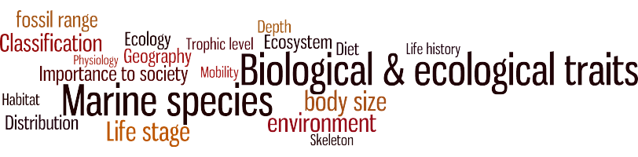

 
```{r, include = FALSE}
knitr::opts_chunk$set(
  collapse = TRUE,
  comment = "#>",
  warning = FALSE,
  message = FALSE
)
```

<!--- Insert image  -->

 
<!--- Describe datatype in one or two sentences. -->
 
Traits data from the World Register of Marine Species ([WoRMS](https://marinespecies.org/traits/aphia.php?p=stats_attributes)).

- Partners: [Marine Species Traits editorial board](https://www.vliz.be/en/imis?module=institute&insid=15115), [Flanders Marine Institute (VLIZ)](https://www.vliz.be/en/imis?module=institute&insid=36), EMODnet Biology, LifeWatch Species Information Backbone
- Period: since 1758
- Geographical coverage: World
- Taxonomic coverage: Biota
- Moratorium: None
- Data quality: Research-grade
 
## How to interpret this dataset
 
### Query options
* **Taxon**:
* **Restrict to life stage**:
* **Restrict to species found in these regions**:
* **Traits**:
* **Include**:
* **Output**:
 
### Available columns
<ul>
  <li><strong>Aphiaid</strong>: Unique identifier for a taxon in WoRMS.</li>
  <li><strong>Scientificname</strong>: Scientific name of the taxon.</li>
  <li><strong>Scientificnameauthorship</strong>: Scientific authority of the taxon.</li>
  <li><strong>Taxonomicstatus</strong>: Taxonomic status of the taxon. For the available statuses we refer to Horton et al., 2017 (<a href='https://marinespecies.org/aphia.php?p=manual' target='_blank' class='url'>https://marinespecies.org/aphia.php?p=manual</a>)</li>
</ul>

<details>
  <summary>Click to see all the columns available: </summary>
	<ul>
<li><strong>Taxonrankid</strong>: Database ID of the rank of the taxon in WoRMS (e.g. 220 is species, 180 is genus).</li>
<li><strong>Highertaxonid</strong>: AphiaID of the higher taxon in WoRMS.</li>
<li><strong>Acceptednameusageid</strong>: AphiaID of the accepted name of the taxon in WoRMS.</li>
<li><strong>Acceptednameusage</strong>: Accepted name of the taxon in WoRMS.</li>
<li><strong>Kingdom</strong>: Kingdom of the taxon in WoRMS.</li>
<li><strong>Phylum</strong>: Phylum of the taxon in WoRMS.</li>
<li><strong>Class</strong>: Class of the taxon in WoRMS.</li>
<li><strong>Order</strong>: Order of the taxon in WoRMS.</li>
<li><strong>Family</strong>: Family of the taxon in WoRMS.</li>
<li><strong>Genus</strong>: Genus of the taxon in WoRMS.</li>
<li><strong>Ismarine</strong>: Marine environment flag of the taxon in WoRMS. 1 = marine, 0 = not marine, null = marine flag not filled in.</li>
<li><strong>Aphiaid</strong>_inherited: AphiaID of the higher taxon from which the trait was inherited.</li>
<li><strong>Sourceid</strong>: Database ID of the trait source in WoRMS.</li>
<li><strong>Qualitystatusid</strong>: Database ID of the quality status of the taxon in WoRMS. 2 = Added by Database Management Team, 3 = Checked by Taxonomic Editor, 4 = Edited by Database Management Team, 5 = Added/edited by Thematic Editor.</li>
<li><strong>Isbrackish</strong>: Brackish environment flag of the taxon in WoRMS. 1 = brackish, 0 = not brackish, null = brackish flag not filled in.</li>
<li><strong>Isfreshwater</strong>: Freshwater environment flag of the taxon in WoRMS. 1 = freshwater, 0 = not freshwater, null = freshwater flag not filled in.</li>
<li><strong>Species</strong>: Species name according to WoRMS.</li>
<li><strong>Isterrestrial</strong>: Terrestrial environment flag of the taxon in WoRMS. 1 = terrestrial, 0 = not terrestrial, null = terrestrial flag not filled in.</li>
<li><strong>Subgenus</strong>: Subgenus of the taxon in WoRMS.</li>
<li><strong>Isextinct</strong>: Extinct flag of the taxon in WoRMS. 1 = extinct, 0 = not extinct, null = not filled in.</li>
<li><strong>Occurrence</strong>: Standardized distributions based on the distributions based on literature in Aphia and the occurrences in OBIS.</li>
<li>Trait<em><strong>observed</strong></em>in: Distribution based on literature that is linked to a certain trait (e.g. Copepods can have different body sizes in different areas).</li>
<li>Trait <strong>note</strong>: Additional information about the trait added as a note with the trait in WoRMS.</li>
<li><strong>Life stage</strong>: Life stage of the taxon. (<a href='https://marinespecies.org/traits/aphia.php?p=attrdefinitions' target='_blank' class='url'>https://marinespecies.org/traits/aphia.php?p=attrdefinitions</a>)</li>
<li><strong>AMBI ecological group</strong>: AZTI’s Marine Biotic Index ecological group. (<a href='https://marinespecies.org/traits/aphia.php?p=attrdefinitions' target='_blank' class='url'>https://marinespecies.org/traits/aphia.php?p=attrdefinitions</a>)</li>
<li><strong>Asexual reproduction</strong>: Whether or not an organism reproduces asexually. (<a href='https://marinespecies.org/traits/aphia.php?p=attrdefinitions' target='_blank' class='url'>https://marinespecies.org/traits/aphia.php?p=attrdefinitions</a>)</li>
<li><strong>Body shape</strong>: The general shape of the body of an organism. (<a href='https://marinespecies.org/traits/aphia.php?p=attrdefinitions' target='_blank' class='url'>https://marinespecies.org/traits/aphia.php?p=attrdefinitions</a>)</li>
<li><strong>Body size</strong>: A measurement of the size of the organism. (<a href='https://marinespecies.org/traits/aphia.php?p=attrdefinitions' target='_blank' class='url'>https://marinespecies.org/traits/aphia.php?p=attrdefinitions</a>)</li>
<li><strong>Body size_valueincentimeter</strong>: A measurement of the size of the organism in centimeter. (<a href='https://marinespecies.org/traits/aphia.php?p=attrdefinitions' target='_blank' class='url'>https://marinespecies.org/traits/aphia.php?p=attrdefinitions</a>)</li>
<li><strong>Body size_dimension</strong>: The dimension of a body size (e.g. length, width, diameter). (<a href='https://marinespecies.org/traits/aphia.php?p=attrdefinitions' target='_blank' class='url'>https://marinespecies.org/traits/aphia.php?p=attrdefinitions</a>)</li>
<li><strong>Body size_type</strong>: The type of a body size (e.g. minimum, maximum, average). (<a href='https://marinespecies.org/traits/aphia.php?p=attrdefinitions' target='_blank' class='url'>https://marinespecies.org/traits/aphia.php?p=attrdefinitions</a>)</li>
<li><strong>Body size_unit</strong>: The unit of a body size (e.g. m, cm, mm). (<a href='https://marinespecies.org/traits/aphia.php?p=attrdefinitions' target='_blank' class='url'>https://marinespecies.org/traits/aphia.php?p=attrdefinitions</a>)</li>
<li><strong>Body size (qualitative)</strong>: Trait that describes the size class of an organism. (<a href='https://marinespecies.org/traits/aphia.php?p=attrdefinitions' target='_blank' class='url'>https://marinespecies.org/traits/aphia.php?p=attrdefinitions</a>)</li>
<li><strong>Brooding</strong>: Whether or not a species is brooding. (<a href='https://marinespecies.org/traits/aphia.php?p=attrdefinitions' target='_blank' class='url'>https://marinespecies.org/traits/aphia.php?p=attrdefinitions</a>)</li>
<li><strong>Calcification</strong>: Mode of calcification of seaweed. (<a href='https://marinespecies.org/traits/aphia.php?p=attrdefinitions' target='_blank' class='url'>https://marinespecies.org/traits/aphia.php?p=attrdefinitions</a>)</li>
<li><strong>Cytomorphology</strong>: Trait that describes whether an organism is unicellular or not. (<a href='https://marinespecies.org/traits/aphia.php?p=attrdefinitions' target='_blank' class='url'>https://marinespecies.org/traits/aphia.php?p=attrdefinitions</a>)</li>
<li><strong>Dispersion mode</strong>: The pattern of distribution of organisms or populations in space. (<a href='https://marinespecies.org/traits/aphia.php?p=attrdefinitions' target='_blank' class='url'>https://marinespecies.org/traits/aphia.php?p=attrdefinitions</a>)</li>
<li><strong>Environmental position</strong>: Position relative to substratum or fluid medium (air/water). (<a href='https://marinespecies.org/traits/aphia.php?p=attrdefinitions' target='_blank' class='url'>https://marinespecies.org/traits/aphia.php?p=attrdefinitions</a>)</li>
<li><strong>Feedingtype</strong>: Feeding type of the organism. (<a href='https://marinespecies.org/traits/aphia.php?p=attrdefinitions' target='_blank' class='url'>https://marinespecies.org/traits/aphia.php?p=attrdefinitions</a>)</li>
<li><strong>Feedingtype_host/prey</strong>: Trait that describes the host or prey of an organism. (<a href='https://marinespecies.org/traits/aphia.php?p=attrdefinitions' target='_blank' class='url'>https://marinespecies.org/traits/aphia.php?p=attrdefinitions</a>)</li>
<li><strong>Fossil range</strong>: Chronostratigraphic range of an organism. (<a href='https://marinespecies.org/traits/aphia.php?p=attrdefinitions' target='_blank' class='url'>https://marinespecies.org/traits/aphia.php?p=attrdefinitions</a>)</li>
<li><strong>Functional group</strong>: Whether a organism belongs to the benthos, plankton, nekton. (<a href='https://marinespecies.org/traits/aphia.php?p=attrdefinitions' target='_blank' class='url'>https://marinespecies.org/traits/aphia.php?p=attrdefinitions</a>)</li>
<li><strong>Gamete type</strong>: Descriptors of the relative size of gametes. (<a href='https://marinespecies.org/traits/aphia.php?p=attrdefinitions' target='_blank' class='url'>https://marinespecies.org/traits/aphia.php?p=attrdefinitions</a>)</li>
<li><strong>Gametophyte arrangement</strong>: Trait that describes the male and female reproductive structures. (<a href='https://marinespecies.org/traits/aphia.php?p=attrdefinitions' target='_blank' class='url'>https://marinespecies.org/traits/aphia.php?p=attrdefinitions</a>)</li>
<li><strong>Generation time</strong>: The average duration of a life cycle between birth and reproduction. (<a href='https://marinespecies.org/traits/aphia.php?p=attrdefinitions' target='_blank' class='url'>https://marinespecies.org/traits/aphia.php?p=attrdefinitions</a>)</li>
<li><strong>Larval and juvenile development</strong>: Description of how the larvae or juveniles develop into adults. (<a href='https://marinespecies.org/traits/aphia.php?p=attrdefinitions' target='_blank' class='url'>https://marinespecies.org/traits/aphia.php?p=attrdefinitions</a>)</li>
<li><strong>Life cycle</strong>: The type of life cycle an organism has. (<a href='https://marinespecies.org/traits/aphia.php?p=attrdefinitions' target='_blank' class='url'>https://marinespecies.org/traits/aphia.php?p=attrdefinitions</a>)</li>
<li><strong>Life span</strong>: Longevity; the maximum or mean duration of life of an individual or group. (<a href='https://marinespecies.org/traits/aphia.php?p=attrdefinitions' target='_blank' class='url'>https://marinespecies.org/traits/aphia.php?p=attrdefinitions</a>)</li>
<li><strong>Macroalgal blooming</strong>: Types of blooming specific for macroalgae species. (<a href='https://marinespecies.org/traits/aphia.php?p=attrdefinitions' target='_blank' class='url'>https://marinespecies.org/traits/aphia.php?p=attrdefinitions</a>)</li>
<li><strong>Mobility</strong>: The tendency of an organism or population to change its location or distribution with time; vagility. (<a href='https://marinespecies.org/traits/aphia.php?p=attrdefinitions' target='_blank' class='url'>https://marinespecies.org/traits/aphia.php?p=attrdefinitions</a>)</li>
<li><strong>Paraphyletic group</strong>: A group of taxa derived from a single ancestral taxon, but one which does not contain all the descendants of the most recent common ancestor. (<a href='https://marinespecies.org/traits/aphia.php?p=attrdefinitions' target='_blank' class='url'>https://marinespecies.org/traits/aphia.php?p=attrdefinitions</a>)</li>
<li><strong>Plant habit</strong>: The characteristic form in which a given species of plant grows. (<a href='https://marinespecies.org/traits/aphia.php?p=attrdefinitions' target='_blank' class='url'>https://marinespecies.org/traits/aphia.php?p=attrdefinitions</a>)</li>
<li><strong>Reproductive frequency</strong>: Trait that describes the fertility period of an organism. (<a href='https://marinespecies.org/traits/aphia.php?p=attrdefinitions' target='_blank' class='url'>https://marinespecies.org/traits/aphia.php?p=attrdefinitions</a>)</li>
<li><strong>Seasonality</strong>: Trait that describes the periodicity of an organism related to the seasons. (<a href='https://marinespecies.org/traits/aphia.php?p=attrdefinitions' target='_blank' class='url'>https://marinespecies.org/traits/aphia.php?p=attrdefinitions</a>)</li>
<li><strong>Sociability</strong>: Trait that describes an organism&#39;s behavioural interactions with members of the same species. (<a href='https://marinespecies.org/traits/aphia.php?p=attrdefinitions' target='_blank' class='url'>https://marinespecies.org/traits/aphia.php?p=attrdefinitions</a>)</li>
<li><strong>Spawning</strong>: The release of gametes or eggs into the water. (<a href='https://marinespecies.org/traits/aphia.php?p=attrdefinitions' target='_blank' class='url'>https://marinespecies.org/traits/aphia.php?p=attrdefinitions</a>)</li>
<li><strong>Species importance to society</strong>: Traits related to IUCN Red List, OSPAR, HELCOM, CITES, Habitats Directive, Birds Directive. (<a href='https://marinespecies.org/traits/aphia.php?p=attrdefinitions' target='_blank' class='url'>https://marinespecies.org/traits/aphia.php?p=attrdefinitions</a>)</li>
<li><strong>Supporting structure &amp; enclosure</strong>: Hard framework, internal or external, which supports and protects softer parts of plant, animal or unicellular organism, and to which muscles usually attach in animals, includes skeletons. (<a href='https://marinespecies.org/traits/aphia.php?p=attrdefinitions' target='_blank' class='url'>https://marinespecies.org/traits/aphia.php?p=attrdefinitions</a>)</li>
<li><strong>Thallus vertical space used</strong>: Trait that describes whether an organism belongs to the canopy, sub-canopy, turf, or is encrusting. (<a href='https://marinespecies.org/traits/aphia.php?p=attrdefinitions' target='_blank' class='url'>https://marinespecies.org/traits/aphia.php?p=attrdefinitions</a>)</li>
<li><strong>Tolerance to pollutants</strong>: Trait that describes how tolerant to pollutants an organism is. (<a href='https://marinespecies.org/traits/aphia.php?p=attrdefinitions' target='_blank' class='url'>https://marinespecies.org/traits/aphia.php?p=attrdefinitions</a>)</li>
<li><strong>Wave exposure</strong>: Trait that describes the range of exposure to wave action in which the organism is recorded. (<a href='https://marinespecies.org/traits/aphia.php?p=attrdefinitions' target='_blank' class='url'>https://marinespecies.org/traits/aphia.php?p=attrdefinitions</a>)</li>
<li><strong>Zonation</strong>: The distribution of organisms in distinctive areas, layers or zones. (<a href='https://marinespecies.org/traits/aphia.php?p=attrdefinitions' target='_blank' class='url'>https://marinespecies.org/traits/aphia.php?p=attrdefinitions</a>)</li>
</ul>
</details>

 
## Abstract
<!-- This information is pulled from the IMIS record of the data type -->
```{r abstract, results = 'asis', echo = FALSE}
# Get the abstract and/or description from IMIS and print here
library(jsonlite)
 
dasid <- fromJSON("https://www.vliz.be/en/imis?module=dataset&dasid=8131&show=json")
 
abstract <- dasid[["datasetrec"]][["EngAbstract"]]
description <- dasid[["datasetrec"]][["EngDescr"]]
 
if (is.null(abstract) & is.null(description)){
   
} else if(is.null(abstract) & !is.null(description)){
  out <- description
} else if(!is.null(abstract) & is.null(description)){
  out <- abstract
} else if(!is.null(abstract) & !is.null(description)){
  out <- paste0(abstract, "</br>", description)
}
 
cat(out)
```


 
## How to cite these data
> Marine Species Traits editorial board (2022). Marine Species Traits. Accessed at http://www.marinespecies.org/traits on yyyy-mm-dd. https://doi.org/10.14284/580

Availability: CC-BY

