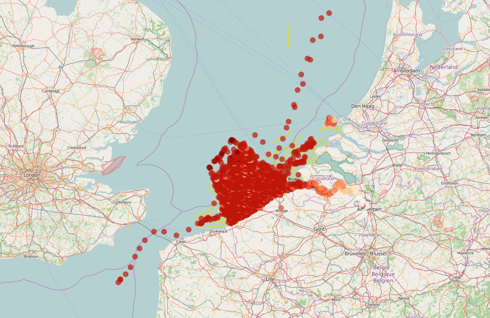

```{r, include = FALSE}
knitr::opts_chunk$set(
  collapse = TRUE,
  comment = "#>",
  warning = FALSE,
  message = FALSE
)
```
<!-- Insert image -->


<!--- Describe datatype in one or two sentences. -->
Data collected by the MIDAS underway continuous sampling system on the RV Zeeleeuw and [RV Simon Stevin](http://www.vliz.be/en/rv-simon-stevin):

- Partners: [Flanders Marine Institute (VLIZ)](https://www.vliz.be/en/imis?module=institute&insid=36)
- Period: since January 2001
- Geographical coverage: [Belgian Exclusive Economic Zone (EEZ)](https://www.marineregions.org/gazetteer.php?p=details&id=3293), [United Kingdom EEZ](https://www.marineregions.org/gazetteer.php?p=details&id=5696), [French EEZ](https://www.marineregions.org/gazetteer.php?p=details&id=5677) and [Dutch EEZ](https://www.marineregions.org/gazetteer.php?p=details&id=5668)
- Taxonomic coverage: Abiotic data only
- Moratorium: None
- Data quality: research-grade
 
## How to interpret this dataset
 
### Query options
* **Timeframe**: Starting and stopping date for the query.
* **Sample period**: Counts aggregated. One of 1 day, 60 min, 10 min or 1 min.
 
### Available columns
* **Time**: .Time in UTC, beginning of sample time period.
* **Latitude**: Center latitude in decimal degrees, WGS84.
* **Longitude**: Center longitude in decimal degrees, WGS84.
* **Temperature**: Temperature of the water body, expressed in degrees Celcius.
* **Salinity**: Salinity of the water body, expressed in PSU.
* **Conductivity**: Conductivity of the water body, expressed in ms/cm.
* **Depth**: Depth between the echosounder and the bottom, measured by echosounder 200 kHz, expressed in m.
* **ChlorophylA**: Concentration of Chlorophyll A, based on fluoresence, measured by SBE21, expressed in µg/L.
* **SpeedMadeGood**: Average speed of the research vessel between a time interval of 5 seconds, expressed in knots.
* **Speedlog**: Speed of water, relative to the hull of the RV Simon Stevin, expressed in knots.
* **TrueWindDir**: Direction of the wind in deg.
* **TrueWindSpeed**: Speed of the wind in m/s.
* **CourseMadeGood**: Average heading of the research vessel between a time interval of 5 seconds, expressed in degrees.
* **Gyro**: Exact heading of the research vessel, measured by Gyro, expressed in degrees.
* **AirTemperature**: Temperature of air, expressed in degrees Celcius.
* **AirPressure**: Atmospheric pressure of the air, expressed in mBar.
* **AirHumidity**: Relative humidity of the air, expressed in %.

## Abstract

```{r abstract, results = 'asis', echo = FALSE}
# Get the abstract and/or description from IMIS and print here
library(jsonlite)

dasid <- fromJSON("https://www.vliz.be/en/imis?module=dataset&dasid=57&show=json")

abstract <- dasid[["datasetrec"]][["EngAbstract"]]
description <- dasid[["datasetrec"]][["EngDescr"]]

if (is.null(abstract) & is.null(description)){
  
} else if(is.null(abstract) & !is.null(description)){
  out <- description
} else if(!is.null(abstract) & is.null(description)){
  out <- abstract
} else if(!is.null(abstract) & !is.null(description)){
  out <- paste0(abstract, "</br>", description)
}

cat(out)
```


## How to cite these data

```{r get citation and license, results = 'asis', echo = FALSE}
library(jsonlite)

# Set base url 5251 4688
url <- "https://www.vliz.be/en/imis?module=dataset&dasid=57"
dasid <- fromJSON(paste0(url, "&show=json"))

# Build citation. Get active DOI.
doi <- dasid[["dois"]]
doi <- subset(doi, doi$CurrentDOI == 1)$DOI
doi <- paste0("https://doi.org/", doi)
citation <- dasid[["datasetrec"]][["Citation"]]
citation <- paste0("> ", citation, " ", doi, 
                   ". Accessed through the LifeWatch Data Explorer / lwdataexplorer R package."
                   )

# Get license
license <- dasid[["datasetrec"]][["AccessConstraint"]]
extra <- dasid[["datasetrec"]][["AccConstrDescription"]]
```

```{r display citation, results = 'asis', echo = FALSE}
cat(citation)
```

```{r display license, results = 'asis', echo = FALSE}
cat(paste0("<b>Availability: </b>", license))
cat(paste0("</br><small>", extra ,"</small></br>"))
```

Please acknowledge as: This work makes use of the LifeWatch observation data and infrastructure (provided by VLIZ) funded by Research Foundation - Flanders (FWO) as part of the Belgian contribution to LifeWatch.

These data are also available in the R language with the [lwdataxplorer package](https://lifewatch.github.io/lwdataexplorer/).
