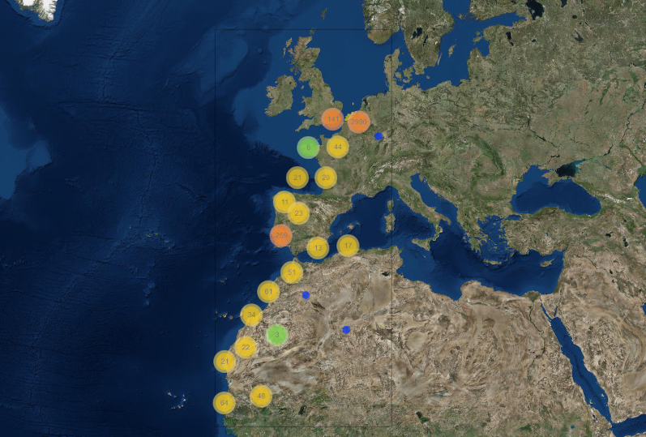

```{r, include = FALSE}
knitr::opts_chunk$set(
  collapse = TRUE,
  comment = "#>",
  warning = FALSE,
  message = FALSE
)
```

<!-- Insert image -->


<!--- Describe datatype in one or two sentences. -->
Data from the Lifewatch bird tracking project collected by stations in Ostend, Zeebrugge and Vlissingen.

- Partners: [Research Institute for Nature and Forest (INBO)](https://www.vliz.be/en/imis?module=institute&insid=5443), [University of Ghent (UGent)](https://www.vliz.be/en/imis?module=institute&insid=1453), [University of Antwerpen](https://www.vliz.be/en/imis?module=institute&insid=4538), [Flanders Marine Institute (VLIZ)](https://www.vliz.be/en/imis?module=institute&insid=36) and [University of Amsterdam (UvA)](https://www.vliz.be/en/imis?module=institute&insid=5647) 
- Period: since May 2013
- Geographical coverage: [Europe](https://marineregions.org/gazetteer.php?p=details&id=1920) and [Africa](https://marineregions.org/gazetteer.php?p=details&id=1923).
- Taxonomic coverage: Herring Gull (HG; [_Larus argentatus_](https://www.marinespecies.org/aphia.php?p=taxdetails&id=137138)), Lesser Black Backed Gull (LLB; [_Larus fuscus_](https://www.marinespecies.org/aphia.php?p=taxdetails&id=137142)) and Marshal Harrier (MH; [_Circus aeruginosus_](https://www.marinespecies.org/aphia.php?p=taxdetails&id=558541)).
- Moratorium: Marshal Harrier data is only available upon registration. Login or [register](https://rshiny.lifewatch.be/account?p=register) to get full access
- Data quality: Research-grade
 
## How to interpret this dataset
 
### Query options
* **Birds or Tag Codes**: Tag number that identifies the birds. You can select specific birds or all together with `All HG` (Herring Gull), `All LBB` (Lesser Black Backed Gull)<sup>1</sup> or `All MH` (Marshal Harrier).
* **Sample period**: Counts aggregated. One of 1 week, 1 day, 60 min, 10 min or 1 min.
* **Timeframe**: Starting and stopping date for the query.
 
### Available columns
* **Code **: Code of device on / in individual.
* **Time **: Time in UTC, beginning of sample timeperiod.
* **Species **: HG = Herring Gull , LBB = Lesser Black Backed Gull, MH = Marshal Harrier.
* **Longitude **: Center longitude in decimal degrees, WGS84.
* **Latitude **: Center latitude in decimal degrees, WGS84.
* **Tracklength **: Length of the track in meters.
* **Maxdist **: Maximum distance from nest.
* **Tracktime **: Length of the track in hours.
* **Counts **: Total GPS fixes or detections.
* **Logcounts **:  Natural logarithm of the counts.

## Abstract

```{r abstract, results = 'asis', echo = FALSE}
# Get the abstract and/or description from IMIS and print here
library(jsonlite)

dasid <- fromJSON("https://www.vliz.be/en/imis?module=dataset&dasid=5249&show=json")

abstract <- dasid[["datasetrec"]][["EngAbstract"]]
description <- dasid[["datasetrec"]][["EngDescr"]]

if (is.null(abstract) & is.null(description)){
  
} else if(is.null(abstract) & !is.null(description)){
  out <- description
} else if(!is.null(abstract) & is.null(description)){
  out <- abstract
} else if(!is.null(abstract) & !is.null(description)){
  out <- paste0(abstract, "</br>", description)
}

cat(out)
```


## How to cite these data

When using this tool, please acknowledge the LifeWatch Data Explorer in your work with the statment written below. Please also acknowledge the individual datasets used and mind their individual licenses: Find the complete list in this link to the [IMIS metadata record](https://www.vliz.be/en/imis?module=dataset&dasid=5249) of this data type.

> _This work makes use of the LifeWatch Data Explorer provided by VLIZ and funded by Research Foundation - Flanders (FWO) as part of the Belgian contribution to LifeWatch._

</br>
If you retrieved these data using the [LifeWatch Data Explorer R package](https://github.com/lifewatch/lwdataexplorer/), you should also cite it as: 

```{r citation, results = 'asis', echo = FALSE}
cat(paste0("> ", citation("lwdataexplorer")$textVersion))
```

<sup>1</sup><small> The correct abbreviation for the Lesser Black-Backed Gull is LBBG. We first used LBB and we keep this for reproducibility.</small>
