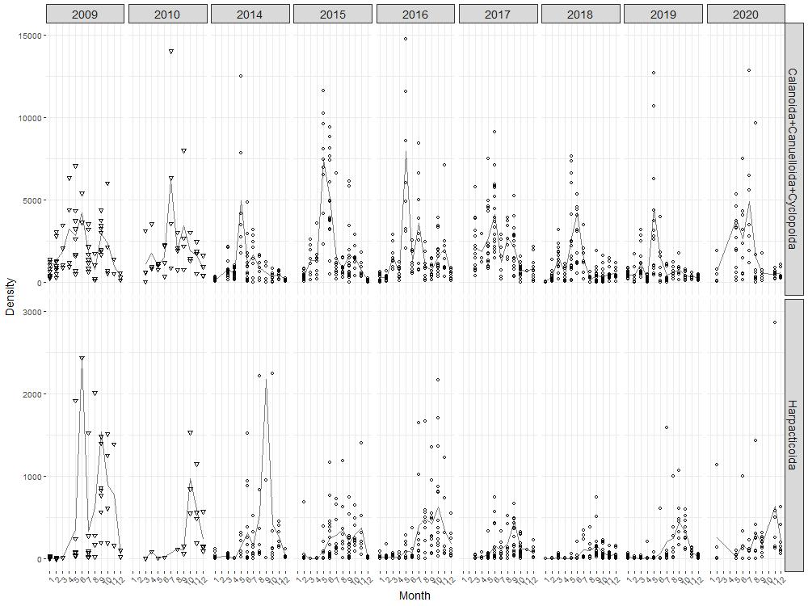

<h1>Exploring zooplankton data</h1>

```{r, include = FALSE}
knitr::opts_chunk$set(
  collapse = TRUE,
  comment = "#>",
  warning = FALSE,
  message = FALSE
)
```

<!-- Insert image -->


<!-- Describe datatype in one or two sentences. -->
Biodiversity data on zooplankton in the Belgian part of the North Sea.

- Partners: [Flanders Marine Institute (VLIZ)](https://www.vliz.be/en/imis?module=institute&insid=36).
- Period: since July 2012.
- Geographical coverage: [Belgian Exclusive Economic Zone](https://www.marineregions.org/gazetteer.php?p=details&id=3293), [Southern Bight of the North Sea](https://marineregions.org/gazetteer.php?p=details&id=2399), [English Channel](https://marineregions.org/gazetteer.php?p=details&id=2389) and [Dutch Exclusive Economic Zone](https://marineregions.org/gazetteer.php?p=details&id=5668).
- Taxonomic coverage: Zooplankton.
- Moratorium: None.
- Data quality: Research-grade.
 
## How to interpret this dataset
 
### Query options
* **Timeframe**: Starting and stopping date for the query.
 
### Available columns
* **Tripaction**: Unique identifier to recognize actions taken aboard the RV Simon Stevin.
* **Fraction**: Indicates the fraction of a scanned sample.
* **Time**: Time in UTC, beginning of sample timeperiod.
* **Station**: Name or code of sampling station or receiver code.
* **ActionType**: The type of sampling equipment.
* **Longitude**: Center longitude in decimal degrees, WGS84.
* **Latitude**: Center latitude in decimal degrees, WGS84.
* **Taxon**: Taxonomic group of organisms or group of artefacts.
* **Count**: The exact number of specimens counted.
* **VolumeC**: A proxy to calculate densities of zooplankton; VolumeC is an exact depth at that sampling point, as measured by the UnderWaySystem of the research vessel (expressed in meter). This value is used to calculate the volume of water sampled.
* **VolumeE**: Standard depth of the station being sampled (expressed in meter). This value is used to calculate the volume of water sampled.
* **VolumeM**: A proxy to calculate densities of zooplankton; VolumeM is an exact measurement of the amount of filtered water (no unit), as measured by a Flowmeter attached to the sampling equipment. This value is used to calculate the volume of water sampled.
* **Density**: Calculated densities of zooplankton expressed in specimens/m<sup>3</sup>, by using the count, fraction, volumeM or volumeC.

## Abstract

In the framework of the LifeWatch marine  observatory a number of fixed stations on the Belgian Part of the North  Sea (BPNS) are visited on a monthly or seasonal basis using the RV Simon Stevin. A grid of nine stations covers the coastal zone and are sampled monthly. Eight additional stations, located further at sea, are sampled on a seasonal basis. In addition, samples collected during the  Jerico-LifeWatch spring campaigns from the Southern Bight of the North Sea are made available via the explorer. 

This dataset contains  zooplankton observations in the Belgian Part of the North Sea (BPNS)  since 2012, and from the Southern Bight since 2018.  

Zooplankton is  sampled by vertical WP2 net tows, samples scanned with ZooScanner and  identification with plankton analyzer software, followed by manual validation.

The full methodology is described in a datapaper:  

> Mortelmans, J.; Goossens, J.; Amadei Martínez, L.; Deneudt, K.;  Cattrijsse, A.; Hernandez, F. (2019). LifeWatch observatory date:  zooplankton observations in the Belgian part of the North Sea.  Geoscience Data Journal: 1-9. [https://hdl.handle.net/10.1002/gdj3.68](https://hdl.handle.net/10.1002/gdj3.68).

## How to cite these data

```{r get citation and license, results = 'asis', echo = FALSE}
library(jsonlite)

# Set base url 5251 4688
url <- "https://www.vliz.be/en/imis?module=dataset&dasid=4687"
dasid <- fromJSON(paste0(url, "&show=json"))

# Build citation. Get active DOI.
doi <- dasid[["dois"]]
doi <- subset(doi, doi$CurrentDOI == 1)$DOI
doi <- paste0("https://doi.org/", doi)
citation <- dasid[["datasetrec"]][["Citation"]]
citation <- paste0("> ", citation, " ", doi, 
                   ". Accessed through the LifeWatch Data Explorer / lwdataexplorer R package."
                   )

# Get license
license <- dasid[["datasetrec"]][["AccConstrDisplay"]]
```

```{r display citation, results = 'asis', echo = FALSE}
cat(citation)
```

```{r display license, results = 'asis', echo = FALSE}
cat(paste0("<b>Availability:</b>", license))
```

Please acknowledge as: This work makes use of the LifeWatch observation data and infrastructure (provided by VLIZ) funded by Research Foundation - Flanders (FWO) as part of the Belgian contribution to LifeWatch.

These data are also available in the R language with the [lwdataxplorer package](https://lifewatch.github.io/lwdataexplorer/).
